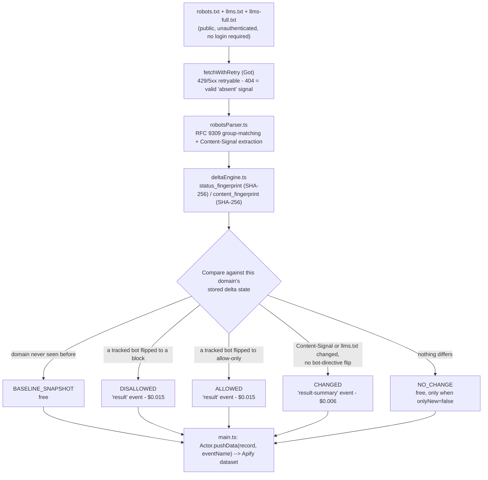

<h1 align="center">AI Crawler & Content-Signal Permission Delta Monitor</h1>
<p align="center"><strong>Know the instant a domain's robots.txt AI-crawler permissions, Cloudflare Content-Signal headers, or llms.txt actually change - not just what they currently say.</strong></p>

<p align="center">
  <a href="https://apify.com"></a>
  <a href="#pricing-pay-per-event"></a>
  <a href="https://www.typescriptlang.org/"></a>
  <a href="LICENSE"></a>
</p>

## Run it

<p align="center">
  <a href="https://apify.com/stefano_seggio/ai-crawler-content-signal-permission-monitor"></a>
</p>

Live and public at [apify.com/stefano_seggio/ai-crawler-content-signal-permission-monitor](https://apify.com/stefano_seggio/ai-crawler-content-signal-permission-monitor). Owner console: [console.apify.com/actors/eWDx4XY54R5GXysFi](https://console.apify.com/actors/eWDx4XY54R5GXysFi).

> This repository is a documentation and integration wrapper around that Actor - the MIT license below covers this repo's own README, snippets, and docs, not the Actor's proprietary TypeScript source, which stays closed and hosted on Apify.

## What this actually monitors

Most "AI crawler checker" tools answer one question once: *what does this domain's robots.txt currently allow?* This Actor answers a different one, continuously: *did it just change?* Point it at any domain - your own property, a vendor, or a competitor - and it re-fetches that domain's `robots.txt` on every scheduled run, parses the `Allow`/`Disallow` directives for 18 tracked AI-crawler user-agent tokens (GPTBot, ChatGPT-User, ClaudeBot, Claude-User, Google-Extended, Applebot-Extended, PerplexityBot, Bytespider, Amazonbot, Meta-ExternalAgent, and others spanning OpenAI, Anthropic, Google, Apple, Perplexity, Common Crawl, ByteDance, Amazon, Meta, Diffbot, and Cohere), and compares the result against the last run's stored fingerprint.

It also tracks two adjacent, faster-moving signals in the same pass: Cloudflare's proposed `Content-Signal` header (the `search`/`ai-input`/`ai-train` categories defined in IETF draft `draft-romm-aipref-contentsignals`) and the presence, absence, or content-hash of `/llms.txt` and `/llms-full.txt`. Any of the three can flip independently of the others, and this Actor reports each kind of flip as its own event type rather than collapsing them into one generic "something changed" alert.

The pain point this solves is manual polling: an SEO team that wants to know when its own site's AI-crawler posture changes after a CMS or CDN edit, an AI vendor's BD team tracking whether a publisher watchlist just blocked or unblocked their crawler, or a competitive-intelligence consultant reporting on a client's competitor set - all of them currently have to re-check `robots.txt` by hand and remember what it said last time. This Actor keeps that state for you and only bills you for an actual delta.

## Architecture



State lives as one Key-Value Store record per domain, keyed under the run's `deltaStateName`. Each domain's check (robots.txt, and optionally llms.txt/llms-full.txt) completes fully within a single run, so there's no partial-completion floor to track the way an unbounded feed needs.

## What it actually does

| Capability | Detail |
|---|---|
| Domain watchlist | `domains` (required) accepts any mix of your own sites and competitor/vendor hostnames; each gets fully independent delta state, so one watchlist can cover both. |
| 18 tracked AI-crawler tokens | `trackedBots` defaults to GPTBot, ChatGPT-User, OAI-SearchBot, ClaudeBot, Claude-User, Claude-SearchBot, Google-Extended, Applebot-Extended, PerplexityBot, Perplexity-User, CCBot, Bytespider, Amazonbot, Meta-ExternalAgent, Meta-ExternalFetcher, Diffbot, cohere-ai, and omgilibot - editable to add a new crawler token or narrow to one vendor family. |
| Cloudflare Content-Signal parsing | `checkContentSignals` (default on) extracts and tracks the `search`/`ai-input`/`ai-train` categories from a `Content-Signal:` line in `robots.txt`, per IETF draft `draft-romm-aipref-contentsignals`. |
| llms.txt / llms-full.txt tracking | `checkLlmsTxt` (default on) fetches both well-known paths and reports an added, removed, or edited file as a `CHANGED` event, keyed on a SHA-256 content hash. |
| Severity-ordered delta classification | `event_type` resolves to `BASELINE_SNAPSHOT` / `ALLOWED` / `DISALLOWED` / `CHANGED` / `NO_CHANGE`; a `DISALLOWED` bot flip always outranks an `ALLOWED` one in a mixed-direction run. |
| Noise control | `onlyNew` (default true) suppresses the free `NO_CHANGE` row on repeat runs so your dataset only fills with actual deltas. |
| Independent schedule state | `deltaStateName` namespaces baselines per schedule (e.g. `own-sites` vs. `competitor-watchlist`) so they never cross-contaminate. |
| Run-size and reliability controls | `maxDomainsPerRun`, `concurrency`, `requestTimeoutSecs`, and `maxRetries` (exponential backoff with jitter, capped at 15s) bound cost and wall-clock time on a large watchlist. |

## Quick start

Get an API token from [console.apify.com/settings/integrations](https://console.apify.com/settings/integrations) (or run `apify auth token` if you use the Apify CLI), then set it as `APIFY_TOKEN` and run:

```bash
apify call eWDx4XY54R5GXysFi --input-file=input.json
```

with an `input.json` matching the real input schema:

```json
{
  "domains": ["cloudflare.com", "openai.com"],
  "trackedBots": ["GPTBot", "ClaudeBot", "Google-Extended", "PerplexityBot"],
  "checkContentSignals": true,
  "checkLlmsTxt": true,
  "onlyNew": true,
  "deltaStateName": "own-sites"
}
```

`domains` is the only required field - every other property falls back to a sensible default (all 18 tracked bots, both extra signals on, `onlyNew: true`). The resulting dataset rows follow the `overview` view in `.actor/dataset_schema.json`: one row per domain per delta event, most recent first.

## Instant Terminal Run (cURL)

Runs synchronously and returns the resulting dataset items directly in the response - no polling needed. Get your token from [console.apify.com/settings/integrations](https://console.apify.com/settings/integrations).

```bash
curl -X POST "https://api.apify.com/v2/acts/eWDx4XY54R5GXysFi/run-sync-get-dataset-items?token=<YOUR_API_TOKEN>" \
  -H "Content-Type: application/json" \
  -d '{
  "domains": [
    "apify.com",
    "openai.com"
  ],
  "onlyNew": true
}'
```

## Sample Extracted Dataset (JSON)

One real record from this Actor's own dataset, matching `.actor/dataset_schema.json`:

```json
{
  "record_id": "openai.com",
  "event_id": "8f2a1c9d3e6b47058a1c4e9f2b5d8a1c4e7f0b3d",
  "event_type": "DISALLOWED",
  "scraped_at": "2026-09-15T14:20:00.000Z",
  "is_new": false,
  "source_url": "https://openai.com/robots.txt",
  "domain": "openai.com",
  "changed_permissions": [
    {
      "bot": "CCBot",
      "previous_directive": "allow",
      "new_directive": "disallow"
    }
  ],
  "status_fingerprint": "c4e9f2b5d8a1c4e7f0b3d8f2a1c9d3e6b4705a1c",
  "content_fingerprint": "d8a1c4e7f0b3d8f2a1c9d3e6b4705a1cc4e9f2b5"
}
```

## Pricing (Pay-Per-Event)

| Event | Price | Charged when |
|---|---|---|
| `BASELINE_SNAPSHOT` | Free | A domain's first-ever check under its `deltaStateName` - always delivered, regardless of other settings. |
| `ALLOWED` / `DISALLOWED` (`result`) | $0.015 | A tracked AI crawler's `robots.txt` directive changed since the last check. `DISALLOWED` wins whenever any bot flipped to a block in the same run. |
| `CHANGED` (`result-summary`) | $0.006 | A Content-Signal category or `llms.txt`/`llms-full.txt` changed, with no bot-directive flip. |
| `NO_CHANGE` | Free | Only delivered when `onlyNew: false`; never charged. |

This is pure Pay-Per-Event (PPE), not BYOK - there's no external API key to bring, since `robots.txt`, `Content-Signal` headers, and `llms.txt` are all public, unauthenticated resources this Actor fetches directly. Every domain's first check is always a free `BASELINE_SNAPSHOT`, and a run with nothing to report costs nothing either - you only pay when this Actor actually detects a permission or content-signal change, never for the audit itself or for confirming that nothing moved.

## Why not just scrape it yourself

- **Zero infrastructure to run or patch.** No server, cron box, or headless browser to keep alive - the fetch layer, retry logic, and per-domain state store already run on Apify's infrastructure.
- **Managed scheduling with state that persists on its own.** Add domains to a `deltaStateName` watchlist once, attach an Apify Schedule, and each domain's baseline and history are tracked automatically in a Key-Value Store record - no database to design or migrate.
- **Retry, backoff, and RFC 9309 parsing already solved.** `fetchWithRetry` (Got) already retries 429/5xx responses with exponential backoff and jitter, and `robotsParser.ts` already implements RFC 9309 most-specific-match group semantics plus Content-Signal extraction - logic that's easy to get subtly wrong writing it yourself.
- **Delta detection, not a one-shot audit.** A plain `curl domain.com/robots.txt` or a one-off checker script tells you what a domain's permissions are *right now*; it can't tell you whether that's different from last week, because it holds no state between checks. This Actor's entire value is the persisted, cross-run comparison.

## Code snippets

Minimal Node.js and Python examples calling this Actor via `apify-client` are included in this repository under [`examples/`](examples) - both authenticate from an `APIFY_API_TOKEN` environment variable, run a two-domain watchlist, wait for the run, and print each resulting `domain: event_type` pair from the dataset.

## About Delta Registry

This Actor is part of **Delta Registry** - a pay-per-event regulatory & compliance data infrastructure operation built by Stefano Seggio, spanning delta monitors across AI-crawler permissions, enforcement registers, and adjacent compliance-signal feeds. For professional inquiries or enterprise licensing, reach out on [LinkedIn](https://www.linkedin.com/in/stefanoseggio-deltaregistry); for the rest of the fleet, see [github.com/stefanoseggio](https://github.com/stefanoseggio).
