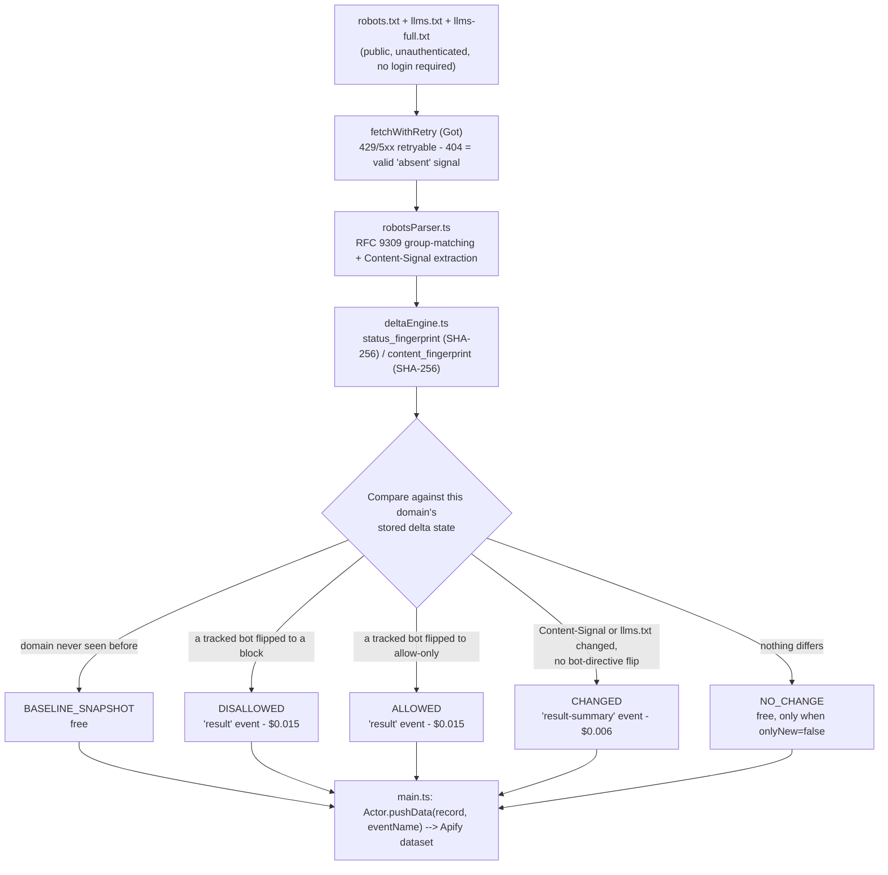

<h1 align="center">AI Crawler & Content-Signal Permission Delta Monitor</h1>
<p align="center"><strong>Know the instant a domain's robots.txt AI-crawler permissions, Cloudflare Content-Signal headers, or llms.txt actually change - not just what they currently say.</strong></p>

<p align="center">
  <a href="https://apify.com"></a>
  <a href="#cost--byok-disclosure"></a>
  <a href="https://www.typescriptlang.org/"></a>
  <a href="LICENSE"></a>
</p>

<p align="center">
  <a href="https://apify.com/stefano_seggio/ai-crawler-content-signal-permission-monitor"></a>
</p>

Monitors any domain, globally, for changes to its robots.txt AI-crawler directives, Cloudflare Content-Signal header, and llms.txt/llms-full.txt files, on whichever schedule you configure via Apify's own Scheduler - there is no fixed built-in cadence.

Live and public at [apify.com/stefano_seggio/ai-crawler-content-signal-permission-monitor](https://apify.com/stefano_seggio/ai-crawler-content-signal-permission-monitor). Owner console: [console.apify.com/actors/eWDx4XY54R5GXysFi](https://console.apify.com/actors/eWDx4XY54R5GXysFi).

> This repository is a documentation and integration wrapper around that Actor - the MIT license below covers this repo's own README, snippets, and docs, not the Actor's proprietary TypeScript source, which stays closed and hosted on Apify.

## What this actually monitors

Most "AI crawler checker" tools answer one question once: *what does this domain's robots.txt currently allow?* This Actor answers a different one, continuously: *did it just change?* Point it at any domain - your own property, a vendor, or a competitor - and it re-fetches that domain's `robots.txt` on every scheduled run, parses the `Allow`/`Disallow` directives for 18 tracked AI-crawler user-agent tokens (GPTBot, ChatGPT-User, ClaudeBot, Claude-User, Google-Extended, Applebot-Extended, PerplexityBot, Bytespider, Amazonbot, Meta-ExternalAgent, and others spanning OpenAI, Anthropic, Google, Apple, Perplexity, Common Crawl, ByteDance, Amazon, Meta, Diffbot, and Cohere), and compares the result against the last run's stored fingerprint.

It also tracks two adjacent, faster-moving signals in the same pass: Cloudflare's proposed `Content-Signal` header (the `search`/`ai-input`/`ai-train` categories defined in IETF draft `draft-romm-aipref-contentsignals`) and the presence, absence, or content-hash of `/llms.txt` and `/llms-full.txt`. Any of the three can flip independently of the others, and this Actor reports each kind of flip as its own event type rather than collapsing them into one generic "something changed" alert.

The pain point this solves is manual polling: an SEO team that wants to know when its own site's AI-crawler posture changes after a CMS or CDN edit, an AI vendor's BD team tracking whether a publisher watchlist just blocked or unblocked their crawler, or a competitive-intelligence consultant reporting on a client's competitor set - all of them currently have to re-check `robots.txt` by hand and remember what it said last time. This Actor keeps that state for you and only bills you for an actual delta.

## Architecture



State lives as one Key-Value Store record per domain, keyed under the run's `deltaStateName`. Each domain's check (robots.txt, and optionally llms.txt/llms-full.txt) completes fully within a single run, so there's no partial-completion floor to track the way an unbounded feed needs.

## What it actually does

| Capability | Detail |
|---|---|
| Domain watchlist | `domains` (required) accepts any mix of your own sites and competitor/vendor hostnames; each gets fully independent delta state, so one watchlist can cover both. |
| 18 tracked AI-crawler tokens | `trackedBots` defaults to GPTBot, ChatGPT-User, OAI-SearchBot, ClaudeBot, Claude-User, Claude-SearchBot, Google-Extended, Applebot-Extended, PerplexityBot, Perplexity-User, CCBot, Bytespider, Amazonbot, Meta-ExternalAgent, Meta-ExternalFetcher, Diffbot, cohere-ai, and omgilibot - editable to add a new crawler token or narrow to one vendor family. |
| Cloudflare Content-Signal parsing | `checkContentSignals` (default on) extracts and tracks the `search`/`ai-input`/`ai-train` categories from a `Content-Signal:` line in `robots.txt`, per IETF draft `draft-romm-aipref-contentsignals`. |
| llms.txt / llms-full.txt tracking | `checkLlmsTxt` (default on) fetches both well-known paths and reports an added, removed, or edited file as a `CHANGED` event, keyed on a SHA-256 content hash. |
| Severity-ordered delta classification | `event_type` resolves to `BASELINE_SNAPSHOT` / `ALLOWED` / `DISALLOWED` / `CHANGED` / `NO_CHANGE`; a `DISALLOWED` bot flip always outranks an `ALLOWED` one in a mixed-direction run. |
| Noise control | `onlyNew` (default true) suppresses the free `NO_CHANGE` row on repeat runs so your dataset only fills with actual deltas. |
| Independent schedule state | `deltaStateName` namespaces baselines per schedule (e.g. `own-sites` vs. `competitor-watchlist`) so they never cross-contaminate. |
| Run-size and reliability controls | `maxDomainsPerRun`, `concurrency`, `requestTimeoutSecs`, and `maxRetries` (exponential backoff with jitter, capped at 15s) bound cost and wall-clock time on a large watchlist. |

## Cost & BYOK Disclosure

This Actor bills on Apify's [Pay-Per-Event](https://apify.com/pricing) model.

| Event name | What triggers it | Price |
|---|---|---|
| `result` (`ALLOWED` / `DISALLOWED`) | A tracked AI crawler's `robots.txt` directive changed since the last check. `DISALLOWED` wins whenever any bot flipped to a block in the same run. | $0.015 per directive flip |
| `result-summary` (`CHANGED`) | A Content-Signal category or `llms.txt`/`llms-full.txt` changed, with no bot-directive flip. | $0.006 per change |
| `BASELINE_SNAPSHOT` | A domain's first-ever check under its `deltaStateName` - always delivered, regardless of other settings. | Free |
| `NO_CHANGE` | Only delivered when `onlyNew: false`; the domain's status and content fingerprints (SHA-256, computed in `deltaEngine.ts`) both matched the previous run. | Free |

Unchanged domains are never billed: when a domain's `status_fingerprint`/`content_fingerprint` pair matches what's stored from the last check, no `result` or `result-summary` event fires - it is suppressed before delivery, not charged and refunded afterward. Every domain's first check is always a free `BASELINE_SNAPSHOT`, and a run that finds nothing new costs nothing at all.

**BYOK: none required.** This is pure Pay-Per-Event, not BYOK - there's no external API key to bring, since `robots.txt`, `Content-Signal` headers, and `llms.txt` are all public, unauthenticated resources this Actor fetches directly.

## Quickstart

Get an API token from [console.apify.com/settings/integrations](https://console.apify.com/settings/integrations) (or run `apify auth token` if you use the Apify CLI).

### cURL (synchronous, no polling)

```bash
curl -X POST "https://api.apify.com/v2/acts/eWDx4XY54R5GXysFi/run-sync-get-dataset-items?token=<YOUR_API_TOKEN>" \
  -H "Content-Type: application/json" \
  -d '{
  "domains": [
    "apify.com",
    "openai.com"
  ],
  "onlyNew": true
}'
```

### Python (`apify-client`)

```python
# pip install apify-client
import os
from apify_client import ApifyClient

# Reads your Apify API token from an environment variable - never hardcode it.
client = ApifyClient(os.environ["APIFY_API_TOKEN"])

run_input = {
    "domains": ["cloudflare.com", "openai.com"],
    "trackedBots": ["GPTBot", "ClaudeBot", "Google-Extended", "PerplexityBot"],
    "checkContentSignals": True,
    "checkLlmsTxt": True,
    "onlyNew": True,
    "deltaStateName": "own-sites",
}

run = client.actor("stefano_seggio/ai-crawler-content-signal-permission-monitor").call(run_input=run_input)
print(f"Run finished with status: {run['status']}")

for item in client.dataset(run["defaultDatasetId"]).iterate_items():
    print(f"{item['domain']}: {item['event_type']} (fetched {item['scraped_at']})")
```

### Node.js (`apify-client`)

```javascript
// npm install apify-client
import { ApifyClient } from 'apify-client';

const client = new ApifyClient({ token: process.env.APIFY_API_TOKEN });

const run = await client.actor('stefano_seggio/ai-crawler-content-signal-permission-monitor').call({
    domains: ['cloudflare.com', 'openai.com'],
    trackedBots: ['GPTBot', 'ClaudeBot', 'Google-Extended', 'PerplexityBot'],
    checkContentSignals: true,
    checkLlmsTxt: true,
    onlyNew: true,
    deltaStateName: 'own-sites',
});

console.log(`Run finished with status: ${run.status}`);

const { items } = await client.dataset(run.defaultDatasetId).listItems();
for (const item of items) {
    console.log(`${item.domain}: ${item.event_type} (fetched ${item.scraped_at})`);
}
```

Runnable copies of the Python and Node.js examples above (calling the Actor by its internal ID rather than its slug) live in `examples/run_monitor.py` and `examples/run-monitor.js` in this repo.

`domains` is the only required field - every other property falls back to a sensible default (all 18 tracked bots, both extra signals on, `onlyNew: true`).

## Use this from Claude Desktop, Cursor, or Windsurf (via MCP)

This Actor is also reachable as an MCP server through Apify's own hosted `@apify/actors-mcp-server`, scoped to just this Actor via a `?tools=` query string - not the full Delta Registry fleet.

**Claude Desktop** (via the `mcp-remote` stdio bridge):

```json
{
  "mcpServers": {
    "delta-registry-ai-crawler-content-signal-permission-monitor": {
      "command": "npx",
      "args": [
        "-y",
        "mcp-remote",
        "https://mcp.apify.com/?tools=stefano_seggio/ai-crawler-content-signal-permission-monitor",
        "--header",
        "Authorization: Bearer ${APIFY_TOKEN}"
      ]
    }
  }
}
```

**Cursor** (native HTTP transport):

```json
{
  "mcpServers": {
    "delta-registry-ai-crawler-content-signal-permission-monitor": {
      "url": "https://mcp.apify.com/?tools=stefano_seggio/ai-crawler-content-signal-permission-monitor",
      "headers": {
        "Authorization": "Bearer ${APIFY_TOKEN}"
      }
    }
  }
}
```

**Windsurf** (uses `serverUrl`, not `url`):

```json
{
  "mcpServers": {
    "delta-registry-ai-crawler-content-signal-permission-monitor": {
      "serverUrl": "https://mcp.apify.com/?tools=stefano_seggio/ai-crawler-content-signal-permission-monitor",
      "headers": {
        "Authorization": "Bearer ${env:APIFY_TOKEN}"
      }
    }
  }
}
```

Replace `${APIFY_TOKEN}` with a real token from [Apify Console → Settings → Integrations](https://console.apify.com/settings/integrations). Note that `mcp-remote` does not expand shell environment variables inside the JSON string itself - paste the literal token and keep this file out of version control; Windsurf's `${env:APIFY_TOKEN}` genuinely does resolve from your environment. For the full 28-actor Delta Registry MCP configuration across all three clients, see [MCP_INTEGRATION.md](https://github.com/stefanoseggio/delta-registry-website/blob/main/MCP_INTEGRATION.md).

## Input & Output Schema

This is a documentation/integration wrapper repo with no local `.actor/input_schema.json` - the field list below is the real, complete input surface as documented and exercised in this README's own examples above.

### Input

| Field | Required | Default | Description |
|---|---|---|---|
| `domains` | Yes | - | Any mix of your own sites and competitor/vendor hostnames; each gets fully independent delta state, so one watchlist can cover both. |
| `trackedBots` | No | all 18 tracked tokens | Which AI-crawler user-agent tokens to check in `robots.txt` (e.g. `GPTBot`, `ClaudeBot`, `Google-Extended`, `PerplexityBot`) - narrow to one vendor family or add a new token. |
| `checkContentSignals` | No | `true` | Extracts and tracks the `search`/`ai-input`/`ai-train` categories from a `Content-Signal:` line in `robots.txt` (IETF draft `draft-romm-aipref-contentsignals`). |
| `checkLlmsTxt` | No | `true` | Fetches `/llms.txt` and `/llms-full.txt` and reports an added, removed, or edited file as a `CHANGED` event, keyed on a SHA-256 content hash. |
| `onlyNew` | No | `true` | Suppresses the free `NO_CHANGE` row on repeat runs so your dataset only fills with actual deltas. |
| `deltaStateName` | No | `"default"` | Namespaces baselines per schedule (e.g. `own-sites` vs. `competitor-watchlist`) so they never cross-contaminate. |
| `resetState` | No | `false` | Wipes all remembered state for this `deltaStateName` before the run, so every domain re-baselines from scratch as a free `BASELINE_SNAPSHOT`. |
| `maxDomainsPerRun` | No | `200` | Hard cap on how many domains from the list are checked (and charged) in a single run; the rest are simply checked next run. |
| `concurrency` | No | `15` | Max simultaneous in-flight HTTP requests across the whole run (each domain fans out to up to 3 fetches). |
| `requestTimeoutSecs` | No | `15` | Per-request timeout; aborts one slow/unresponsive fetch without stalling the whole run. |
| `maxRetries` | No | `4` | Retry attempts on 429/5xx/timeout, exponential backoff with jitter capped at 15s. |

### Output

One row per domain per delta event, most recent first, following the `overview` view in `.actor/dataset_schema.json`.

#### Sample Extracted Dataset (JSON)

```json
{
  "record_id": "openai.com",
  "event_id": "8f2a1c9d3e6b47058a1c4e9f2b5d8a1c4e7f0b3d",
  "event_type": "DISALLOWED",
  "scraped_at": "2026-09-15T14:20:00.000Z",
  "is_new": false,
  "source_url": "https://openai.com/robots.txt",
  "domain": "openai.com",
  "changed_permissions": [
    {
      "bot": "CCBot",
      "previous_directive": "allow",
      "new_directive": "disallow"
    }
  ],
  "status_fingerprint": "c4e9f2b5d8a1c4e7f0b3d8f2a1c9d3e6b4705a1c",
  "content_fingerprint": "d8a1c4e7f0b3d8f2a1c9d3e6b4705a1cc4e9f2b5"
}
```

#### Field reference

| Field | Description |
|---|---|
| `record_id` | The domain this record is about (also used as the delta-state key). |
| `event_id` | Stable id for this specific delta event. |
| `event_type` | `BASELINE_SNAPSHOT`, `ALLOWED`, `DISALLOWED`, `CHANGED`, or `NO_CHANGE`. |
| `scraped_at` | ISO-8601 timestamp of this run. |
| `is_new` | `true` only on this domain's first-ever check (`BASELINE_SNAPSHOT`). |
| `source_url` | The exact `robots.txt` (or `llms.txt`) URL fetched for this record. |
| `domain` | The watched hostname. |
| `changed_permissions` | Array of `{ bot, previous_directive, new_directive }` objects - one entry per AI-crawler token whose directive flipped this run. Present on `ALLOWED`/`DISALLOWED` events. |
| `bot_permissions` | Object with one entry per tracked bot token: the matched directive (`allow`, `disallow`, or `not_specified`), the matched path pattern, and which mechanism produced the match. |
| `content_signals` | Cloudflare Content-Signal category values (`search`, `ai_input`, `ai_train`), each `yes`, `no`, or `null` if absent; all `null` when `checkContentSignals` is off. |
| `llms_txt` / `llms_full_txt` | Presence, URL, SHA-256 content hash, and byte size of `/llms.txt` and `/llms-full.txt` at fetch time; `present: false` and other fields `null` if absent or `checkLlmsTxt` is off. |
| `changed_content_signals` | Present only on `CHANGED` events caused by a Content-Signal flip - one entry per category with its previous and new value. |
| `llms_txt_change` | Present only on a `CHANGED` event caused by an `llms.txt`/`llms-full.txt` presence or content change - previous/new presence and previous/new content hash; `null` otherwise. |
| `status_fingerprint` | SHA-256 hash over the domain's bot-directive state, compared run-over-run to detect `ALLOWED`/`DISALLOWED`. |
| `content_fingerprint` | SHA-256 hash over Content-Signal + llms.txt state, compared run-over-run to detect `CHANGED`. |

## Why not just scrape it yourself

- **Zero infrastructure to run or patch.** No server, cron box, or headless browser to keep alive - the fetch layer, retry logic, and per-domain state store already run on Apify's infrastructure.
- **Managed scheduling with state that persists on its own.** Add domains to a `deltaStateName` watchlist once, attach an Apify Schedule, and each domain's baseline and history are tracked automatically in a Key-Value Store record - no database to design or migrate.
- **Retry, backoff, and RFC 9309 parsing already solved.** `fetchWithRetry` (Got) already retries 429/5xx responses with exponential backoff and jitter, and `robotsParser.ts` already implements RFC 9309 most-specific-match group semantics plus Content-Signal extraction - logic that's easy to get subtly wrong writing it yourself.
- **Delta detection, not a one-shot audit.** A plain `curl domain.com/robots.txt` or a one-off checker script tells you what a domain's permissions are *right now*; it can't tell you whether that's different from last week, because it holds no state between checks. This Actor's entire value is the persisted, cross-run comparison.

## Contributing & Local Setup

As disclosed above, this repository is a documentation and integration wrapper - the Actor's real fetch/parsing/delta-engine TypeScript source (`robotsParser.ts`, `deltaEngine.ts`, `main.ts`) is proprietary and runs privately on Apify's platform, not checked into this repository. There is no `src/` here to clone and hack on.

That means useful contributions here are: improving this README, fixing or extending the Node.js/Python examples in [`examples/`](examples), or reporting a documentation error via a GitHub issue or PR on this repo. To report a bug in the Actor's actual behavior, request a new tracked bot token, or ask a product question, use the Apify Store's own Issues tab on the [Store listing](https://apify.com/stefano_seggio/ai-crawler-content-signal-permission-monitor) - that's where the Actor's real maintainer (also the author of this repo) triages requests against the live source.

## About Delta Registry

This Actor is part of **Delta Registry** - a pay-per-event regulatory & compliance data infrastructure operation built by Stefano Seggio, spanning delta monitors across AI-crawler permissions, enforcement registers, and adjacent compliance-signal feeds. For professional inquiries or enterprise licensing, reach out on [LinkedIn](https://www.linkedin.com/in/stefanoseggio-deltaregistry); for the rest of the fleet, see [github.com/stefanoseggio](https://github.com/stefanoseggio).
